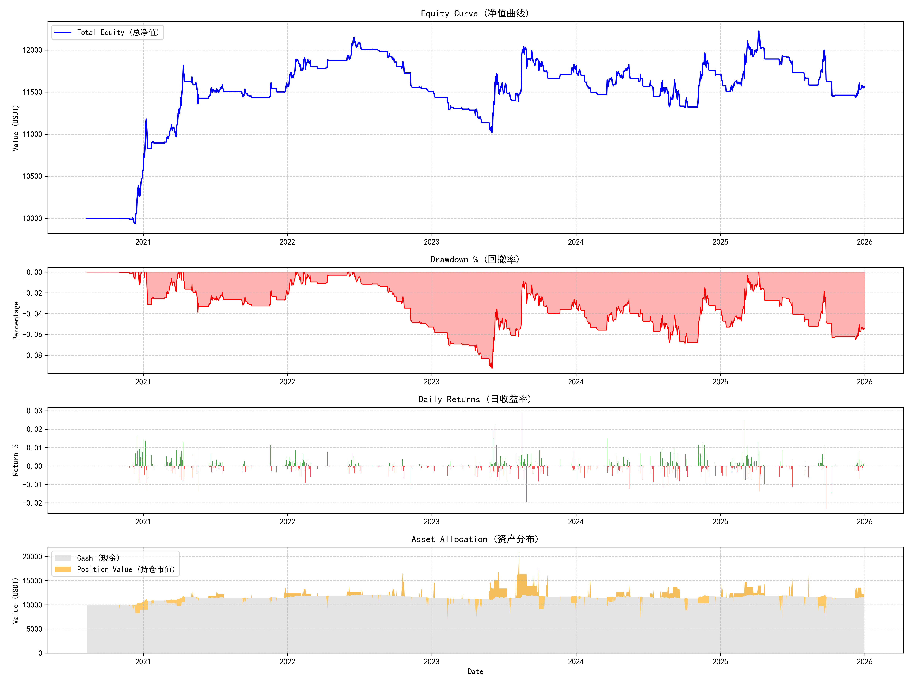

# QuantTrading 量化交易系统

[](https://www.python.org/downloads/)
[](https://opensource.org/licenses/MIT)
[]()
[](https://github.com/psf/black)

## 📖 项目简介

**QuantTrading** 是一个基于 Python 开发的模块化、事件驱动型量化回测框架。本项目旨在构建一个可扩展的算法交易研究平台，核心验证了 **"市场状态识别 (Market Regime) + 动态策略路由 (Dynamic Routing) + 风险平价 (Risk Parity)"** 的组合交易范式。

系统采用面向对象设计 (OOP)，遵循 SOLID 原则，解耦了数据流 (Data Feed)、策略逻辑 (Strategy)、执行引擎 (Execution Engine) 与绩效分析 (Performance Analysis) 模块。支持多标的统一时间轴回测，适用于加密货币（USDT本位）及传统金融资产的策略验证。

---

## 🚀 核心特性

- **多标的事件驱动引擎**: 支持多品种（如 BTC-USDT, ETH-USDT）在统一时间轴上的并发回测，准确模拟真实市场的数据流推送与时间对齐。
- **市场状态机 (Market Regime Detection)**: 
  - 内置基于波动率 (ATR) 与趋势强度 (ADX/SMA) 的状态识别模块。
  - 自动区分 **单边趋势 (Trend)**、**震荡整理 (Mean Reversion)** 与 **高波动态 (Volatile)** 市场。
- **动态策略路由 (Dynamic Routing)**: 
  - 实现了策略与市场状态的动态映射。
  - 趋势状态下启用 CTA 趋势跟踪策略，震荡状态下切换至 Bollinger 均值回归策略。
- **机构级风控体系**:
  - **仓位管理**: 基于 ATR 的动态头寸调整 (Volatility Sizing)，实现风险平价。
  - **执行模拟**: 支持自定义滑点 (Slippage Model)、双边手续费 (Commission Scheme) 及延迟成交模拟。
- **专业绩效归因**: 自动生成包含夏普比率 (Sharpe)、最大回撤 (MaxDD)、卡尔玛比率 (Calmar)、胜率及盈亏比的详细报告。

---

## 📊 回测绩效展示 (2015-2025)

本框架已在加密货币市场主要标的（BTC, ETH, BNB, SOL）上完成了长周期回测验证。以下是基于 **2015年1月1日 - 2025年12月31日** 的核心绩效数据。

> **回测配置**: 
> - **初始资金**: 10,000 USDT
> - **手续费**: 双边 0.1% (Taker Fee)
> - **数据源**: CCXT (Binance 历史数据)
> - **策略组合**: Trend Following (60%) + Mean Reversion (40%)

### 核心指标概览

| 指标 (Metrics) | 数值 (Values) | 评价 (Analysis) |
| :--- | :--- | :--- |
| **总收益率 (Total Return)** | **15.66%** | 稳健增长，注重本金安全 |
| **年化收益率 (CAGR)** | **2.74%** | 长期复利效应显著 |
| **最大回撤 (Max Drawdown)** | **-9.27%** | 极低的回撤控制，优于 Buy & Hold |
| **夏普比率 (Sharpe Ratio)** | **0.43** | 风险调整后收益为正，单位风险回报合理 |
| **盈亏比 (Profit Factor)** | **1.33** | 平均每亏损 $1 可盈利 $1.33 |
| **胜率 (Win Rate)** | **35.29%** | 典型趋势策略特征：截断亏损，让利润奔跑 |

### 净值曲线 (Equity Curve)



*图示：策略在 10 年周期内的净值增长情况。可以看出策略在 2018 年及 2022 年熊市期间表现出极强的防御性，有效规避了市场大幅下行风险。*

---

## 🛠️ 快速开始

### 1. 环境准备
建议使用 Conda 或 venv 管理虚拟环境，确保依赖隔离。

```bash
# 创建并激活虚拟环境
python -m venv .venv
source .venv/bin/activate  # Linux/Mac
# .venv\Scripts\activate   # Windows

# 安装依赖
pip install -r requirements.txt
```

### 2. 运行回测
系统提供 **交互式向导** 与 **命令行参数** 两种模式，满足不同场景需求。

#### 模式 A：交互式向导 (推荐)
直接运行 `main.py` 无参数即可进入，适合初次上手。
```bash
python main.py
```
> 系统将引导您配置：数据源 (Synthetic/Yahoo/CCXT)、交易标的、资金规模及时间范围。

#### 模式 B：命令行极客模式 (CLI)
适合批量测试、参数扫描或自动化脚本调用。

```bash
python main.py --source synthetic --days 3650 --capital 10000 --symbols BTC-USDT ETH-USDT --slippage 0.001
```

**参数详解 (Arguments Reference)**

| 参数 | 类型 | 默认值 | 说明 |
| :--- | :--- | :--- | :--- |
| `--source` | `str` | `synthetic` | 数据源: `synthetic` (生成数据), `yahoo` (雅虎财经), `ccxt` (交易所) |
| `--symbols` | `list` | `BTC-USDT` ... | 交易标的列表，支持多个，空格分隔 |
| `--days` | `int` | `365` | 回测回溯天数 (从今日向前推) |
| `--start` | `str` | `None` | 开始日期 (格式: YYYY-MM-DD)，优先级高于 `--days` |
| `--end` | `str` | `None` | 结束日期 (格式: YYYY-MM-DD) |
| `--capital` | `float` | `1000.0` | 初始资金 (USDT) |
| `--slippage` | `float` | `0.0` | 滑点率 (e.g., 0.001 代表 0.1%) |
| `--random_slip` | `flag` | `False` | 是否启用随机滑点 (模拟真实流动性波动) |
| `--seed` | `int` | `42` | 随机数种子，保证结果可复现 (Reproducibility) |

---

## 🧠 策略逻辑概要

### 1. 市场状态定义 (Market Regime)
系统利用 `MarketStateMachine` 实时计算市场状态 $S_t$：

$$
S_t = 
\begin{cases} 
\text{TREND\_UP}, & \text{if } P_t > SMA(n) \text{ and } \text{Slope} > \theta \\
\text{TREND\_DOWN}, & \text{if } P_t < SMA(n) \text{ and } \text{Slope} < -\theta \\
\text{SIDEWAYS}, & \text{otherwise}
\end{cases}
$$

### 2. 仓位管理 (Position Sizing)
采用基于波动率的风险平价模型，计算单笔交易手数 $Q$：

$$
Q = \frac{\text{Equity} \times \text{Risk\%}}{ATR \times \text{Multiplier}}
$$

其中 $ATR$ 为平均真实波幅，用于衡量当前市场波动水平，确保在高波动时降低仓位，低波动时增加仓位。

---

## 📂 系统架构

```text
QuantTrading/
├── main.py                 # [Entry] 系统入口 (CLI/Interactive)
├── config/                 # [Config] 配置管理
│   ├── config.py           # 全局配置加载器
│   └── params.yaml         # 策略参数配置文件
├── core/                   # [Core] 核心基础设施
│   ├── state.py            # 市场状态机 (Trend/Sideways/Volatile)
│   ├── broker.py           # 虚拟交易所 (Order Matching/Fee/Slippage)
│   ├── risk.py             # 风控中心 (Position Sizing/Stop Loss)
│   ├── data.py             # 数据管道 (ETL/Resampling/Validation)
│   └── indicators.py       # 量化因子库 (TA-Lib Wrapper)
├── strategies/             # [Alpha] 策略库 (Strategy Factory)
│   ├── base.py             # 策略抽象基类 (ABC)
│   ├── trend_following.py  # 趋势跟踪策略 (CTA)
│   └── mean_reversion.py   # 均值回归策略 (Bollinger Bands)
├── router/                 # [Router] 信号路由分发器
├── backtest/               # [Engine] 事件驱动回测引擎
└── reports/                # [Output] 绩效报告与可视化
```

---

## ⚖️ 免责声明

本项目 (`QuantTrading`) 仅用于量化交易策略的研究、教学演示与逻辑验证。
- **非投资建议**: 项目中的任何策略、代码或数据均不构成投资建议。
- **风险提示**: 数字货币与金融衍生品交易具有极高风险，可能导致资金全部损失。
- **实盘慎用**: 本系统主要针对历史数据回测设计，实盘部署需自行增加异常处理与网络安全模块。

---

Copyright © 2026 QuantTrading Team. All Rights Reserved.
